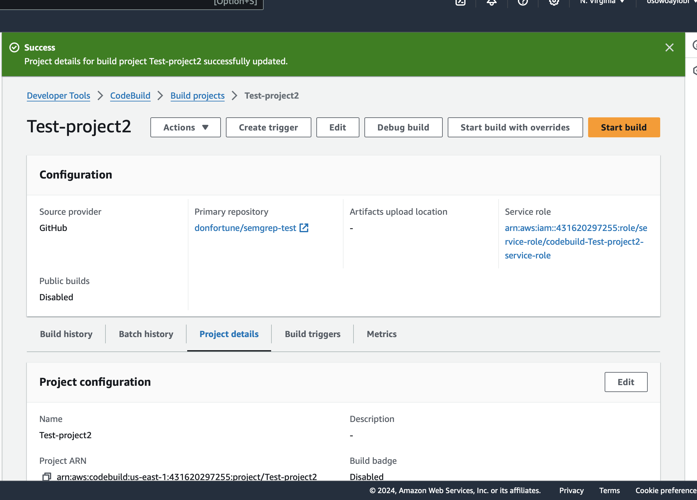

# Semgrep AWS CodeBuild Workflow

This repository contains documentation and configurations for establishing a Semgrep scanning workflow within AWS CodeBuild. The main objective is to set up Semgrep scanning for AWS CodeBuild.

## Introduction

Semgrep is an open-source static analysis tool with various applications including code maintenance, security vulnerability identification, code quality enhancement, and enforcing best practices. It offers customizable rules and supports multiple programming languages including Python, Java, Go, and Ruby.

### Features of Semgrep:

- **Language Support**: Semgrep supports multiple programming languages.
- **Custom Rules**: Users can define custom rules using Semgrep.
- **Integration**: Semgrep can be seamlessly integrated into various CI/CD pipelines and workflows.
- **Community and Ecosystem**: Semgrep has an active community and ecosystem supporting its development.
- **Pattern Matching**: Semgrep facilitates pattern matching for effective code analysis.

### Steps to Accomplish the Task

1. **Local Test**:
   - Install Semgrep locally using `pip install semgrep`.
   - Write a simple Python program.
     
   - Set up rules for Semgrep to follow.
     
   - Run the Semgrep command: `semgrep --config ruleset.yaml main.py`.
     

2. **Integration with AWS CodeBuild Workflow**:
   - Push the Python file, ruleset, and buildspec files to GitHub.
     
   - Create a project on AWS CodeBuild.
     
     
     
     
     
   - Start the build.
     
   - Build success
     
   - logs
     
     
